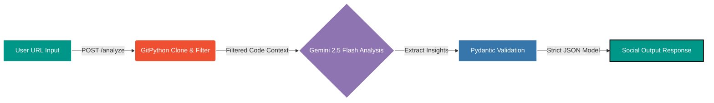

# 🧠 The Repository Oracle

> **An Agentic AI Content Engine that transforms raw source code into high-signal social media insights using Gemini 2.5 Flash.**


The Repository Oracle is a streamlined, agentic application that clones public codebases and distills their architecture, patterns, and logic into ready-to-post social media gold. 

## 🗺️ Visual Architecture



## ✨ Core Features

- **⚡ Async Execution**: Powered by FastAPI background tasks to effortlessly handle repository lifecycle management and filesystem cleanup post-computation.
- **🔍 Intelligent Context Filtering**: Recursively clones the target repository and heavily filters out noise, keeping only high-impact application code (`.py`, `.js`, `.go`, `.md`).
- **📱 Multi-Platform Content**: Instantly generates:
  - 📸 High-hype Instagram Captions
  - 💼 Deep-dive LinkedIn Insights focused on Architecture
  - 🎨 DALL-E 3 Creative Prompts to visualize the codebase

## 🚀 Quick Start

Get up and running locally in under a minute.

1. **Clone the repository**
   ```bash
   git clone https://github.com/SaiReddy-Sr/repository-oracle.git
   cd repository-oracle
   ```

2. **Initialize your Environment**
   ```bash
   pip install -r requirements.txt
   cp .env.example .env
   # Open .env and add your GEMINI_API_KEY
   ```

3. **Ignite the Server**
   ```bash
   uvicorn main:app --reload
   ```
   Head over to `http://localhost:8000/docs` to test the API directly from the Swagger UI!
